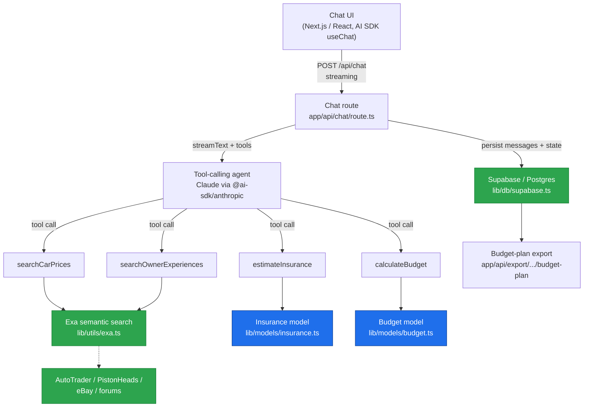

# CarMind — AI car-buying advisor for the UK

A conversational advisor that helps UK car buyers work out what they can actually afford, then researches the real cost of owning a specific car — purchase price, insurance, tax, fuel and maintenance — and turns it into a month-by-month savings plan.

CarMind pairs a tool-calling Claude agent with two hand-written domain models: a UK take-home-pay/affordability calculator (`lib/models/budget.ts`) and an actuarial-style insurance estimator (`lib/models/insurance.ts`). Instead of asking an LLM to guess at numbers, the agent calls these deterministic models for the maths and uses Exa semantic search to ground prices and reliability reports in real UK listings and owner forums. The result is advice that's honest about affordability rather than optimistic.

<!-- SCREENSHOTS -->

## Architecture



## How it works

The chat endpoint (`app/api/chat/route.ts`) runs a tool-calling loop with Claude through the Vercel AI SDK (`streamText` + `@ai-sdk/anthropic`). A stateful system prompt (`lib/prompts/advisor-prompt.ts`) walks the user through six phases — financial intake → preferences → reality check → car suggestions → deep research → budget plan — and the agent decides when to call each tool.

Four tools are wired into the agent (`lib/utils/ai-tools.ts`, Zod-typed):

- **`calculateBudget`** → `lib/models/budget.ts`. The differentiator. A hand-written UK affordability model: `calculateTakeHome()` applies the 2024/25 income-tax bands (personal allowance, 20/40/45% rates) and Class 1 employee National Insurance (12% / 2% bands) to derive net pay; the budget logic then sizes a 3-month emergency fund, computes disposable income, and works out a maximum sensible purchase price and months-to-ready. No LLM guesswork — it's deterministic arithmetic.
- **`estimateInsurance`** → `lib/models/insurance.ts`. The other differentiator. A multiplicative premium model over a national base premium, combining hand-tuned multipliers for driver age (17 → 66+), insurance group (1–50), UK location (London / major city / urban / rural, derived from postcode area), No-Claims-Bonus years, and annual mileage. Ships with an insurance-group lookup table for ~30 common enthusiast cars (MX-5, E46, GT86, Fiesta ST, Type R, Boxster, Golf GTI, etc.) and returns a low/mid/high range plus per-factor explanations and a confidence score.
- **`searchCarPrices`** → `lib/utils/exa.ts`. Exa semantic search restricted to UK automotive domains (AutoTrader, PistonHeads, eBay, CarGurus, Motors), with regex price extraction to build a low/median/high range.
- **`searchOwnerExperiences`** → `lib/utils/exa.ts`. Exa search across owner forums and communities for reliability reports and common problems, deduplicated by URL.

Sessions and conversation history are persisted to Postgres via Supabase (`lib/db/supabase.ts`, schema in `supabase/migrations/`). A separate research route (`app/api/research/[carId]`) composes the price + ownership + insurance lookups into a running-cost breakdown, and an export route (`app/api/export/[sessionId]/budget-plan`) returns the finished plan as structured JSON for client-side PDF rendering.

> **Status note:** This is a working prototype, not a finished product. The chat loop, both domain models and the Exa tools are implemented and the budget/insurance maths is genuinely usable. A DVLA Vehicle Enquiry Service client (`lib/utils/dvla.ts`) and a month-by-month plan generator (`generateBudgetPlan` in `budget.ts`) are written but not yet wired into the agent's tool set. There are also a couple of known type errors that block `next build` — see [`docs/STATUS.md`](docs/STATUS.md).

## Tech stack

- **Framework:** Next.js 16 (App Router, edge runtime, Turbopack), React 19, TypeScript 5
- **AI:** Claude via `@ai-sdk/anthropic`, orchestrated with the Vercel AI SDK (`ai`, `@ai-sdk/react`); `@mastra/core` is present as a dependency
- **Search:** Exa (`exa-js`) semantic web search
- **Vehicle data:** DVLA Vehicle Enquiry Service (REST, client implemented)
- **Data:** Supabase / Postgres (`@supabase/supabase-js`)
- **UI:** Tailwind CSS 4, `react-markdown` + `remark-gfm`, Zustand
- **PDF:** `@react-pdf/renderer` (client-side)

## Local setup

**Prerequisites:** Node.js 18+, and API keys for Anthropic, Exa, DVLA VES and a Supabase project.

```bash
git clone https://github.com/mahesh-dilip/CarBuyingHelper.git
cd CarBuyingHelper
npm install

cp .env.example .env.local   # then fill in your keys
```

Set up the database — create a Supabase project and run the migration in `supabase/migrations/20241228_init_schema.sql` (paste it into the Supabase SQL editor, or `npx supabase db push`).

Run it:

```bash
npm run dev      # http://localhost:3000
```

Environment variables (see `.env.example` for the full list): `ANTHROPIC_API_KEY`, `EXA_API_KEY`, `DVLA_API_KEY`, `NEXT_PUBLIC_SUPABASE_URL`, `NEXT_PUBLIC_SUPABASE_ANON_KEY`, `SUPABASE_SERVICE_ROLE_KEY`.

## Project structure

```
app/
  api/
    chat/                  # streaming tool-calling chat loop
    session/               # session create / get / update
    research/[carId]/      # composes price + ownership + insurance
    export/[sessionId]/    # budget-plan JSON for PDF export
components/chat/           # chat UI
lib/
  models/
    budget.ts              # UK tax/NI + affordability model
    insurance.ts           # premium multipliers + group table
  utils/
    exa.ts                 # Exa search wrappers
    dvla.ts                # DVLA VES client
    ai-tools.ts            # Zod-typed agent tool definitions
  prompts/advisor-prompt.ts
  db/supabase.ts
types/index.ts
supabase/migrations/
```

## License

No license specified yet — all rights reserved by default. Add a `LICENSE` file before reuse.
